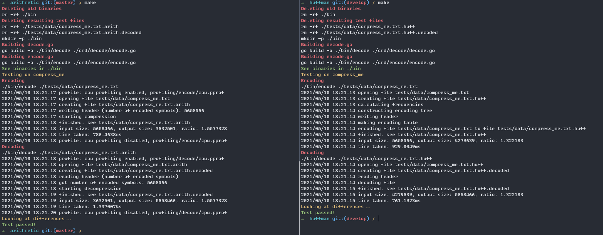

# 'Adaptive' arithmetic compression
Arithmetic compression/decompression tool

### Building: `make all`
### Binaries will be placed to `./bin/`

### Comparison with [huffman](https://github.com/cravtos/huffman):

